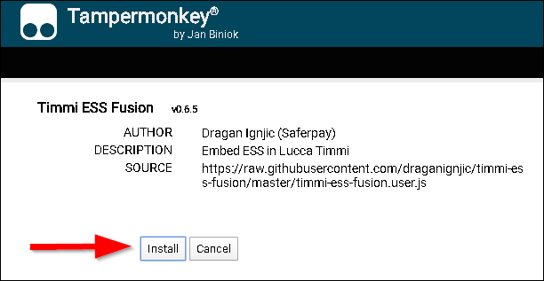
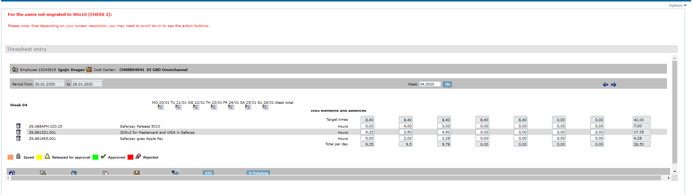
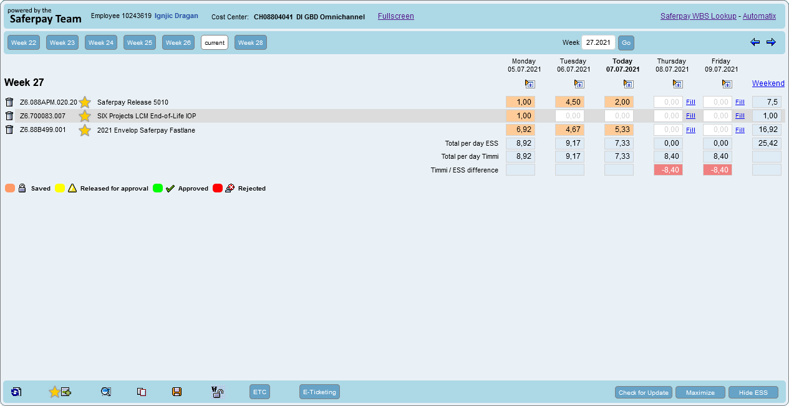

# Timmi ESS Fusion
Userscript for improving ESS usability

## Installation Chrome
1. https://chrome.google.com/webstore/detail/tampermonkey/dhdgffkkebhmkfjojejmpbldmpobfkfo?hl=en
2. https://raw.githubusercontent.com/draganignjic/timmi-ess-fusion/master/timmi-ess-fusion.user.js
3. 

## Installation Firefox
1. https://addons.mozilla.org/de/firefox/addon/tampermonkey/
2. https://raw.githubusercontent.com/draganignjic/timmi-ess-fusion/master/timmi-ess-fusion.user.js
3. 

## Preview
This is how ESS looks without the userscript

This is how ESS looks with the userscript

## Features
- Chrome and Firefox support for approve/reject colors
- Favourites (Save workitems and give them meaningful names)
- ESS is displayed beautifully in all browsers
- Enter worktime with "." or ","
- Save on Enter Key
- No Session Timeout
- Fullscreen

## Features for employees that use Timmi Timesheet as well (Switzerland)
- ESS is embedded in Timmi
- Synchronization of workhours. ESS shows you the differences that you need to book on projects
- Book all remaining hours with one click on a project
- "Check for Updates" Feature
- Automatic conversion of minutes to decimal hours (8h24m => 8.4 hours)
- Hide the weekend
- Maximize ESS to see the weekend

### Credits
Dragan Ignjic
