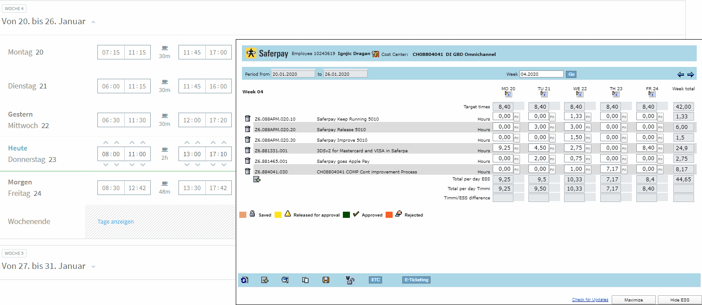

# Timmi ESS Fusion
Userscript for improving ESS Timesheet usability

## Installation 
### Chrome
1. [Tampermonkey Browser Extension](https://chrome.google.com/webstore/detail/tampermonkey/dhdgffkkebhmkfjojejmpbldmpobfkfo?hl=en) needs to be installed
2. Open [timmi-ess-fusion.user.js](https://raw.githubusercontent.com/draganignjic/timmi-ess-fusion/master/timmi-ess-fusion.user.js)
3. 

### Firefox
1. [Tampermonkey Browser Extension](https://addons.mozilla.org/de/firefox/addon/tampermonkey/) needs to be installed
2. Open [timmi-ess-fusion.user.js](https://raw.githubusercontent.com/draganignjic/timmi-ess-fusion/master/timmi-ess-fusion.user.js)
3. 

## Preview
#### Before
This is how ESS looks without the userscript

#### After
This is how ESS looks with the userscript

This is how ESS looks in combination with Timmi Timesheet

## Features
- Fullscreen Mode
  - To get rid of scrollbars
- Chrome and Firefox support
  - See saved, released, approved and reject colors
  - Day titles are aligned correctly
- Favourites
  - Save workitems
  - Give them meaningful names
  - Select them with one click at the top of the worklist
- Design
  - ESS is displayed beautifully in all browsers
- Usability
  - Enter worktime with "." or ","
  - Save with pressing the Enter Key
  - No Session Timeout

## Features for employees that use Timmi Timesheet as well (Switzerland)
- ESS is embedded in Timmi
- Synchronization of workhours. ESS shows you the differences that you need to book on projects
- Book all remaining hours with one click on a project
- "Check for Updates" Feature
- Automatic conversion of minutes to decimal hours (8h24m => 8.4 hours)
- Hide the weekend
- Maximize ESS to see the weekend

#### Credits
Dragan Ignjic
