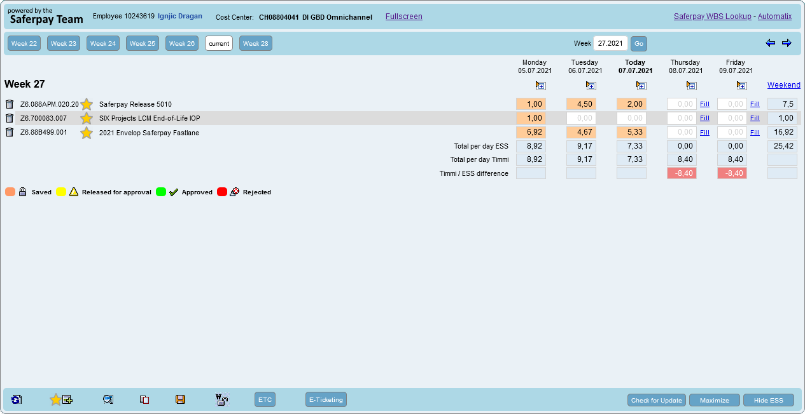
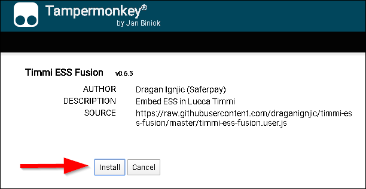
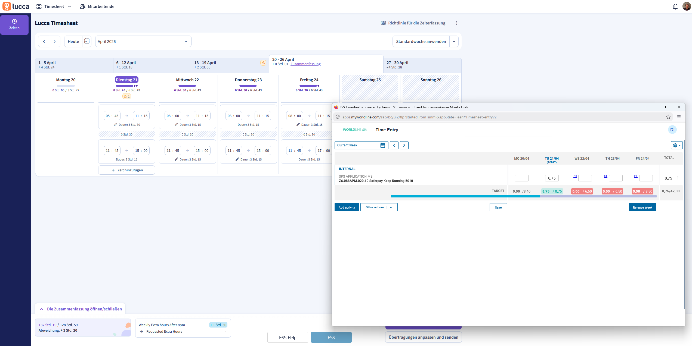

# Timmi ESS Fusion
Userscript for improving ESS Timesheet usability

## Installation 
### Chrome
1. [Tampermonkey Browser Extension](https://chrome.google.com/webstore/detail/tampermonkey/dhdgffkkebhmkfjojejmpbldmpobfkfo?hl=en) needs to be installed

2. Open [timmi-ess-fusion.user.js](https://raw.githubusercontent.com/draganignjic/timmi-ess-fusion/master/timmi-ess-fusion.user.js)

3. Click on Install

### Firefox
1. [Tampermonkey Browser Extension](https://addons.mozilla.org/de/firefox/addon/tampermonkey/) needs to be installed

2. Open [timmi-ess-fusion.user.js](https://raw.githubusercontent.com/draganignjic/timmi-ess-fusion/master/timmi-ess-fusion.user.js)

3. Click on Install

## Preview
This is how ESS works in combination with Timmi Timesheet :scream:

## Features
- Timmi Timesheet integration
  - ESS is embedded in Timmi as a PopUp
  - Synchronization of workhours. ESS shows you the differences that you need to book on projects
  - Book all remaining hours with one click on a project

#### Credits
Dragan Ignjic

Made in Switzerland
